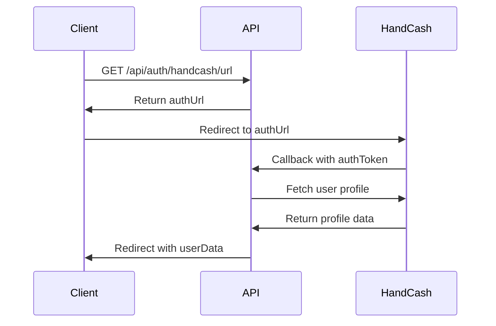

# API Documentation
# Bitcoin Blockchain Spreadsheet

## Overview

The Bitcoin Blockchain Spreadsheet API provides endpoints for HandCash authentication, user profile management, and spreadsheet operations. The API is built with Node.js/Express and deployed on Vercel.

**Base URLs:**
- **Development**: `http://localhost:3001`
- **Production**: `https://bitcoin-spreadsheet-api.vercel.app`

**API Version**: 1.0  
**Authentication**: HandCash OAuth 2.0  
**Content Type**: `application/json`

## Authentication Flow

The API uses HandCash OAuth 2.0 for authentication. The flow involves redirecting users to HandCash for authorization and receiving an auth token.



## API Endpoints

### 1. Health Check

**GET** `/api/health`

Check API server status and configuration.

#### Response
```json
{
  "status": "ok",
  "appId": "68c532b2a0b054ff147f4579",
  "hasSecret": true
}
```

#### Example
```bash
curl -X GET http://localhost:3001/api/health
```

---

### 2. Get HandCash Authorization URL

**GET** `/api/auth/handcash/url`

Generate HandCash OAuth authorization URL for user login.

#### Response
```json
{
  "authUrl": "https://app.handcash.io/#/authorizeApp?appId=68c532b2a0b054ff147f4579"
}
```

#### Example
```bash
curl -X GET http://localhost:3001/api/auth/handcash/url
```

#### Error Response
```json
{
  "error": "Failed to generate auth URL"
}
```

---

### 3. HandCash OAuth Callback

**GET** `/api/auth/handcash/callback`

Handle OAuth callback from HandCash with authorization token.

#### Query Parameters
| Parameter | Type | Required | Description |
|-----------|------|----------|-------------|
| authToken | string | Yes | Authorization token from HandCash |

#### Success Response
Redirects to client URL with user data:
```
https://yourapp.com?userData=<base64-encoded-user-data>
```

#### Error Response
Redirects to client URL with error:
```
https://yourapp.com?error=authentication_failed
```

#### Example
```bash
# This endpoint is called by HandCash, not directly by clients
GET /api/auth/handcash/callback?authToken=abc123xyz789
```

---

### 4. Get User Profile (Legacy)

**GET** `/api/auth/handcash/profile`

Get authenticated user's profile information.

#### Headers
```
Authorization: Bearer <authToken>
```

#### Success Response
```json
{
  "handle": "bitcoin.spreadsheet",
  "paymail": "bitcoin.spreadsheet@handcash.io",
  "displayName": "Bitcoin Spreadsheet",
  "avatarUrl": "https://handcash.io/avatar/bitcoin.spreadsheet"
}
```

#### Error Responses
```json
// No auth token
{
  "error": "No auth token provided"
}

// Invalid/expired token
{
  "error": "Failed to get profile"
}

// Demo mode (no app secret)
{
  "handle": "demo_user",
  "paymail": "demo@handcash.io",
  "displayName": "Demo User",
  "avatarUrl": "https://handcash.io/avatar/default"
}
```

#### Example
```bash
curl -X GET http://localhost:3001/api/auth/handcash/profile \
  -H "Authorization: Bearer your-auth-token"
```

---

### 5. Get User Profile (Preferred)

**POST** `/api/handcash-profile`

Get authenticated user's profile information using POST method.

#### Request Body
```json
{
  "authToken": "string"
}
```

#### Success Response
```json
{
  "success": true,
  "profile": {
    "handle": "bitcoin.spreadsheet",
    "paymail": "bitcoin.spreadsheet@handcash.io",
    "displayName": "Bitcoin Spreadsheet",
    "avatarUrl": "https://handcash.io/avatar/bitcoin.spreadsheet",
    "publicKey": "02a1b2c3d4e5f6...",
    "email": "user@example.com",
    "phoneNumber": "+1234567890"
  }
}
```

#### Error Response
```json
{
  "error": "Failed to get profile",
  "details": "Invalid auth token"
}
```

#### Demo Mode Response
```json
{
  "success": true,
  "profile": {
    "handle": "demo_user",
    "paymail": "demo@handcash.io",
    "displayName": "Demo User",
    "avatarUrl": null
  }
}
```

#### Example
```bash
curl -X POST http://localhost:3001/api/handcash-profile \
  -H "Content-Type: application/json" \
  -d '{"authToken": "your-auth-token"}'
```

## Frontend Service APIs

### BitcoinService

The `BitcoinService` class provides client-side blockchain and encryption functionality.

#### Methods

##### `connect(): Promise<void>`
Initialize connection to HandCash wallet.

```typescript
const bitcoinService = new BitcoinService();
await bitcoinService.connect();
```

##### `createSpreadsheet(title: string): Promise<SpreadsheetData>`
Create a new spreadsheet.

```typescript
const spreadsheet = await bitcoinService.createSpreadsheet("My Spreadsheet");
```

##### `updateCell(id: string, row: number, col: number, value: string, dataType: string): Promise<void>`
Update a cell with encrypted data.

```typescript
await bitcoinService.updateCell("sheet_123", 0, 0, "Hello World", "string");
```

##### `getCell(id: string, row: number, col: number): Promise<CellData | null>`
Retrieve and decrypt cell data.

```typescript
const cell = await bitcoinService.getCell("sheet_123", 0, 0);
```

##### `calculateFormula(formula: string, cells: object): Promise<string>`
Calculate formula results.

```typescript
const result = await bitcoinService.calculateFormula("=SUM(A1:A5)", cells);
```

##### `getBalance(): Promise<string>`
Get wallet balance in BSV.

```typescript
const balance = await bitcoinService.getBalance(); // "0.00100000"
```

##### `getAddress(): Promise<string>`
Get wallet address or paymail.

```typescript
const address = await bitcoinService.getAddress(); // "user@handcash.io"
```

---

### HandCashAuthService

The `HandCashAuthService` class handles OAuth authentication with HandCash.

#### Methods

##### `login(): Promise<void>`
Start OAuth login flow (redirects to HandCash).

```typescript
const authService = new HandCashAuthService();
await authService.login();
```

##### `handleCallback(url: string): Promise<HandCashUser>`
Handle OAuth callback from HandCash.

```typescript
const user = await authService.handleCallback(window.location.href);
```

##### `logout(): void`
Clear user session and logout.

```typescript
authService.logout();
```

##### `isAuthenticated(): boolean`
Check if user is authenticated.

```typescript
if (authService.isAuthenticated()) {
  // User is logged in
}
```

##### `getCurrentUser(): HandCashUser | null`
Get current user information.

```typescript
const user = authService.getCurrentUser();
if (user) {
  console.log(`Hello, @${user.handle}!`);
}
```

## Data Types

### SpreadsheetData
```typescript
interface SpreadsheetData {
  id: string;
  title: string;
  cells: { [key: string]: CellData };
  owner: string;
  publicKey?: string;
}
```

### CellData
```typescript
interface CellData {
  row: number;
  col: number;
  value: string;
  dataType: 'number' | 'string' | 'formula';
  lastUpdated: number;
  encrypted?: boolean;
}
```

### HandCashUser
```typescript
interface HandCashUser {
  handle: string;
  paymail: string;
  publicKey?: string;
  avatarUrl?: string;
  displayName?: string;
}
```

### AuthTokens
```typescript
interface AuthTokens {
  accessToken: string;
  refreshToken?: string;
  expiresIn?: number;
  tokenType?: string;
}
```

## Error Handling

### HTTP Status Codes
- `200` - Success
- `400` - Bad Request (missing parameters)
- `401` - Unauthorized (invalid/missing auth token)
- `404` - Not Found (invalid endpoint)
- `500` - Internal Server Error

### Error Response Format
```json
{
  "error": "Error message",
  "details": "Additional error details (optional)"
}
```

### Common Error Scenarios

#### Authentication Errors
```json
{
  "error": "No auth token provided"
}
```

#### HandCash API Errors
```json
{
  "error": "Failed to get profile",
  "details": "HandCash API returned 401"
}
```

#### Configuration Errors
```json
{
  "error": "No HandCash secret configured, returning demo data"
}
```

## Rate Limiting

Currently no rate limiting is implemented, but it will be added in production:

- **Development**: No limits
- **Production**: 100 requests per 15 minutes per IP

## CORS Policy

### Development
```javascript
{
  origin: '*',  // Allow all origins
  credentials: true
}
```

### Production (Recommended)
```javascript
{
  origin: ['https://bitcoin-spreadsheet.vercel.app'],
  credentials: true
}
```

## Environment Variables

### Required Variables
```bash
# HandCash App Configuration
HANDCASH_APP_ID=your_app_id
HANDCASH_APP_SECRET=your_app_secret

# Client Configuration
CLIENT_URL=https://your-frontend-domain.com

# Server Configuration
PORT=3001
```

### Optional Variables
```bash
# Development overrides
REACT_APP_HANDCASH_APP_ID=your_dev_app_id
REACT_APP_HANDCASH_APP_SECRET=your_dev_app_secret
```

## Security Considerations

### API Security
- Use HTTPS in production
- Validate all inputs
- Implement rate limiting
- Add proper CORS configuration
- Use security headers (Helmet.js)

### Authentication Security
- Store tokens securely
- Implement token expiration
- Use secure session management
- Validate tokens on each request

### Data Security
- Encrypt sensitive data
- Use secure key derivation
- Implement proper access controls
- Audit data access patterns

## Testing

### Manual Testing
```bash
# Health check
curl http://localhost:3001/api/health

# Get auth URL
curl http://localhost:3001/api/auth/handcash/url

# Test profile endpoint
curl -X POST http://localhost:3001/api/handcash-profile \
  -H "Content-Type: application/json" \
  -d '{"authToken": "test-token"}'
```

### Automated Testing
```bash
# Run API tests
cd api
npm test

# Run integration tests
npm run test:integration
```

## Future API Enhancements

### Planned Endpoints
- `POST /api/spreadsheets` - Create spreadsheet
- `GET /api/spreadsheets/:id` - Get spreadsheet
- `PUT /api/spreadsheets/:id/cells/:cellId` - Update cell
- `GET /api/spreadsheets/:id/cells` - Get all cells
- `POST /api/spreadsheets/:id/share` - Share spreadsheet
- `GET /api/users/me` - Get current user
- `POST /api/formulas/calculate` - Calculate formulas

### Planned Features
- WebSocket support for real-time collaboration
- File upload/download endpoints
- Bulk operations
- Advanced authentication (JWT)
- API versioning
- GraphQL support

## SDKs and Libraries

### JavaScript/TypeScript SDK (Planned)
```typescript
import { BitcoinSpreadsheetAPI } from '@bitcoin-spreadsheet/sdk';

const api = new BitcoinSpreadsheetAPI({
  baseUrl: 'https://api.bitcoin-spreadsheet.com',
  authToken: 'your-token'
});

const spreadsheet = await api.spreadsheets.create('My Sheet');
await api.cells.update(spreadsheet.id, 0, 0, 'Hello World');
```

### Other SDKs (Future)
- Python SDK
- Go SDK
- REST API client generators (OpenAPI)

---

*API Documentation Version: 1.0*  
*Last Updated: December 2024*  
*Next Review: January 2025*